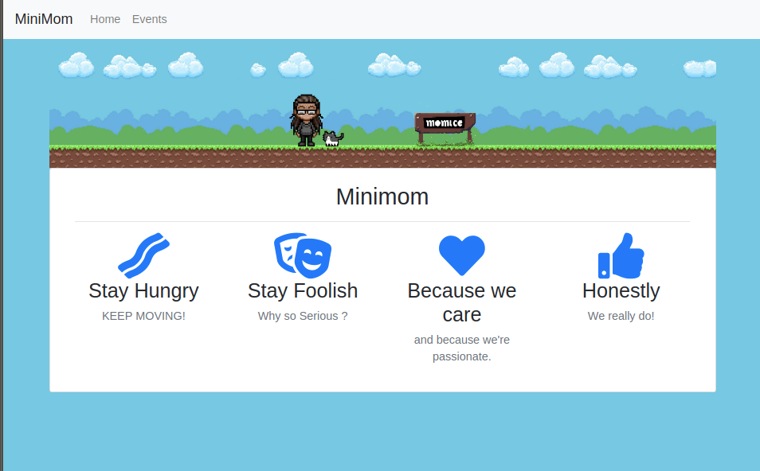
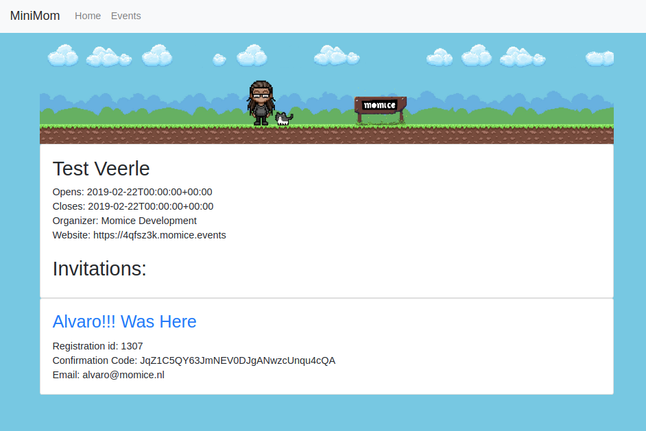

# minimom

* The project can be run with ```php artisan serve```
* it has two main nav pages
* it doesn't use a database, so should be ready to go
* it uses external asset links, no need to compile webpack/laravel-mix

<hr><br>






Please note that the credentials i was given do not have permissions to/for all the event invitations. You might see a  very simplified error page if you click around.

Also please note i mainly abused the tests to check my API output, they should not be regarded/judged as real unittests

The cat in the banner-image is called Zola, he also loves (mo)mice!